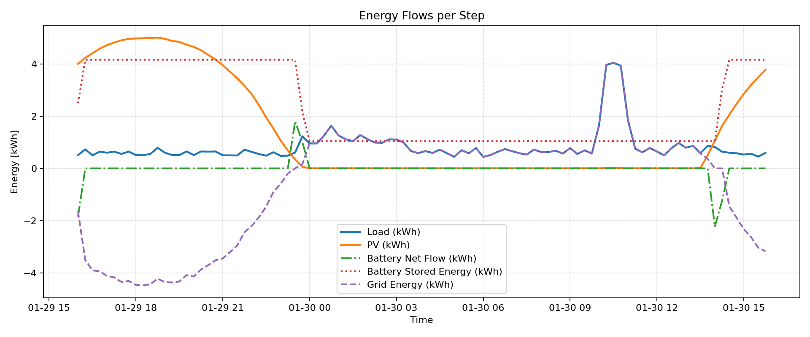
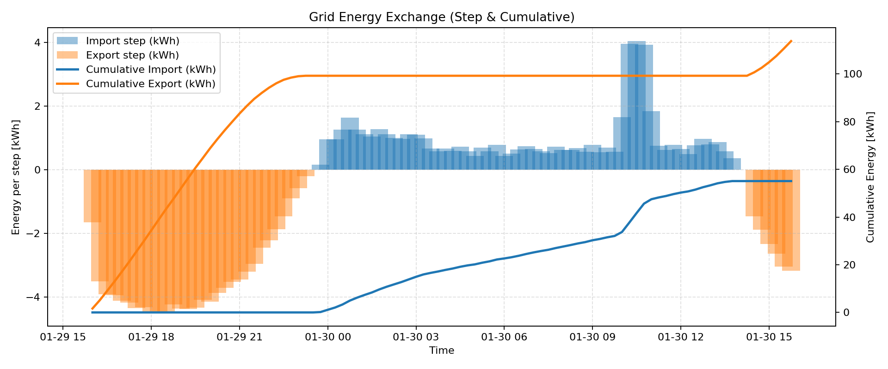
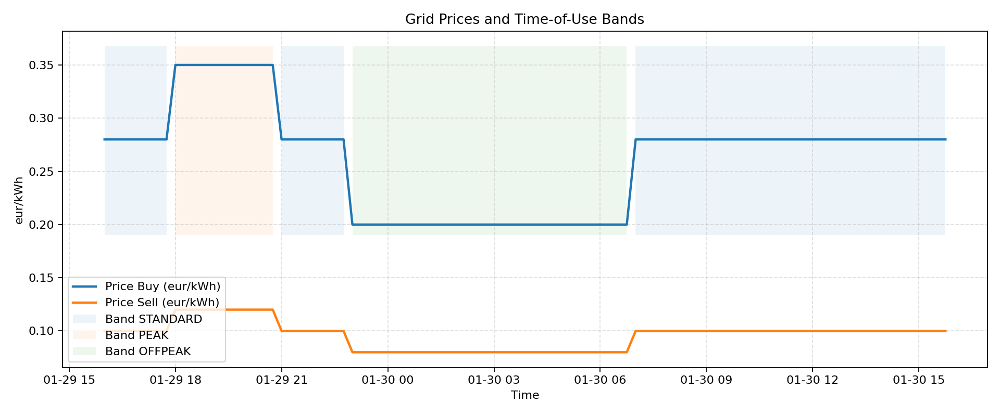
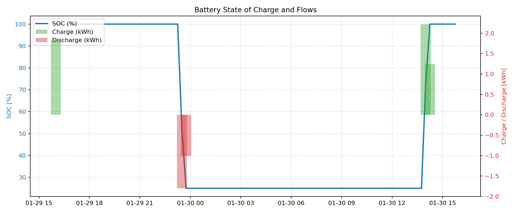
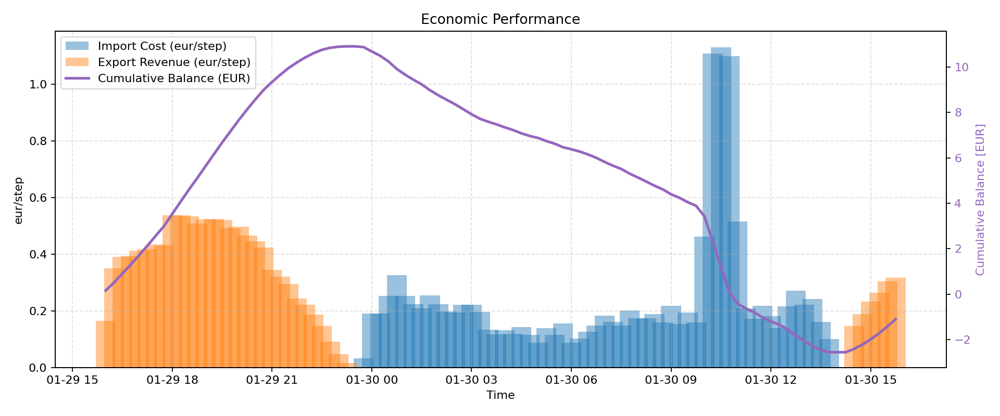

# Guida Completa alla Simulazione (ODA → Generatore → EMS)

Questa guida descrive tutti i passaggi per eseguire un ciclo completo:

1. Avvio della piattaforma **ODA** (Open Data Aggregator).
2. Esecuzione del **generatore** Kafka che invia dati quartorari in kWh.
3. Avvio dell’**EMS** (`ems_realtime_kafka.py`) che consuma i dati, popola la microgrid e crea report.

> Repository ODA: [https://github.com/di-unipi-socc/ODA](https://github.com/di-unipi-socc/ODA)

---

## 1. Prerequisiti

- Git.
- Docker + Docker Compose.
- Python 3.10 o superiore con `pip`.
- Dataset CSV con colonne `datetime, solar, load` (energie in kWh per intervallo).
- Porte libere: `50005` (API Gateway), `9094`/`9095` (Kafka), `8086` (InfluxDB).

Struttura consigliata delle cartelle (stesso livello):

```
D:\MieiProgetti\ODA
D:\MieiProgetti\generator_and_consumer
D:\MieiProgetti\microgrid-simulator
```

---

## 2. Avvio di ODA

```bash
git clone https://github.com/di-unipi-socc/ODA.git
cd ODA
```

1. Apri `.env` e verifica/compila:
   ```env
   kafka_address=127.0.0.1
   kafka_port=9094
   kafka_address_static=127.0.0.1
   kafka_port_static=9095
   ```
   Senza questi valori Kafka e l’API Gateway non partono.
2. Avvia i container:
   ```bash
   ./start.sh
   ```
3. Verifica l’API Gateway:
   ```bash
   curl http://localhost:50005/register/dc
   ```
   L’output deve contenere `KAFKA_ENDPOINT`.
4. Per fermare ODA:
   ```bash
   ./stop.sh
   ```

---

## 3. Generatore Realtime Kafka

Cartella: `generator_and_consumer`

```bash
cd generator_and_consumer
python -m venv venv
venv\Scripts\activate           # Windows
# oppure: source venv/bin/activate
pip install -r requirements.txt
```

Il generatore legge i CSV da `generator_and_consumer/data/`. Il file di default è `data/processed_data_661_formatted.csv`, ma puoi aggiungere altri dataset nello stesso percorso.

Parametri in `generatore_realtime_kafka.py`:

```python
API_GATEWAY_URL = "http://localhost:50005"
TOPIC = "test_topic_661"
GENERATOR_ID = "casa_661"
DATA_FILE = Path(__file__).resolve().parent / "data" / "processed_data_661_formatted.csv"
DELTA_T_SEC = 0.5
```

Esegui:

```bash
python generatore_realtime_kafka.py
```

Lo script registra il generatore (`POST /register/dg`), legge il CSV e invia i pacchetti JSON. Sul terminale stampa timestamp e valori (in kWh). Lasciare in esecuzione fino al termine della simulazione.

---

## 4. EMS (`ems_realtime_kafka.py`)

Cartella: `microgrid-simulator`

```bash
cd microgrid-simulator
python -m venv mio_env_ems
mio_env_ems\Scripts\activate    # Windows
# oppure: source mio_env_ems/bin/activate
pip install -r requirements.txt
```

### Configurazione (`params.yml`)

```yaml
ems:
  kafka_topic: test_topic_661
  buffer_size: 96
  timezone: Europe/Rome
  steps: 96
  price_bands:
    peak:
      buy: 0.35
      sell: 0.12
      ranges:
        - [18, 20]
    standard:
      buy: 0.28
      sell: 0.10
      ranges:
        - [7, 17]
        - [21, 22]
    offpeak:
      buy: 0.20
      sell: 0.08
      ranges: []
```

Le sezioni `battery` e `grid` definiscono limiti e potenze; adattale alla durata dello step (0,25 h per 15 minuti). `steps` controlla la lunghezza della simulazione (96 → 24 h, 672 → 7 giorni).

`ems_realtime_kafka.py` importa `consumer_class` dal pacchetto `generator_and_consumer`; la cartella è aggiunta automaticamente al `sys.path`.

### Esecuzione

```bash
python ems_realtime_kafka.py
```

Lo script:

1. Carica `params.yml`.
2. Avvia `KafkaConsumer` e aspetta il primo messaggio.
3. Costruisce la microgrid (`MicrogridSimulator`) in modalità online.
4. Per ogni step legge l’ultimo valore, applica `rule_based_control`, esegue `microgrid.step`, stampa un report e memorizza i risultati.
5. Al termine:
   - salva `outputs/ems_results_<timestamp>.csv`;
   - genera i grafici (flussi energia, scambi rete, prezzi, SOC batteria, economia) sempre in `outputs/`;
   - stampa un riepilogo e apre i grafici (se possibile).

> **Nota:** la cartella `outputs/` viene creata automaticamente. Verifica che sia presente o versionala con un file `.gitkeep` se necessario.

---

## 5. Sequenza consigliata

1. `./start.sh` nella cartella ODA.
2. `python generatore_realtime_kafka.py` (lascia in esecuzione).
3. `python ems_realtime_kafka.py` nella cartella `microgrid-simulator`.
4. Controlla i log EMS e attendi il salvataggio in `outputs/`.
5. Per fermare: `Ctrl+C` su EMS e generatore, poi `./stop.sh` in ODA.

---

## 6. Esempio di output (96 step)

Grafici generati automaticamente (files copiati in `docs/images/` per riferimento):

  
*Flussi per step: carico, produzione PV, flusso batteria netto ed energia accumulata.*

  
*Energia import/export per step (barre) e cumulata (linee).*

  
*Prezzi di acquisto/vendita con le fasce temporali evidenziate.*

  
*Stato di carica (%) e energia di carica/scarica.*

  
*Costi/ricavi per step e bilancio economico cumulato.*

---

## 7. Troubleshooting rapido

| Problema | Possibile causa / soluzione |
| --- | --- |
| `requests.exceptions.ConnectionError` dal generatore | ODA non è avviata o l’API Gateway (porta 50005) non risponde. |
| `KeyError: 'KAFKA_ENDPOINT'` | La risposta di `/register/dg` è vuota/errata. Controlla i log del gateway. |
| L'EMS rimane in attesa | Il generatore non ha inviato dati (topic errato, CSV vuoto, `steps` troppo alto). |
| Grafici con asse tempo sballato | Verifica i timestamp nel CSV e la timezone in `params.yml`. |
| Batteria non si carica | La logica attuale carica solo con surplus PV. Modifica `rule_based_control` per consentire carica da rete. |

---

## 8. Risorse utili

- `generator_and_consumer/consumatore_realtime_kafka.py`: consumer standalone per debug (in kWh).
- `generator_and_consumer/consumer_class.py`: classe riutilizzabile del Kafka consumer a buffer.
- `microgrid-simulator/ems_realtime_kafka_guide.txt`: documentazione dettagliata dell’EMS.
- Repository ODA: [https://github.com/di-unipi-socc/ODA](https://github.com/di-unipi-socc/ODA)

> Tutti i risultati della simulazione vengono salvati nella cartella `microgrid-simulator/outputs/`.
