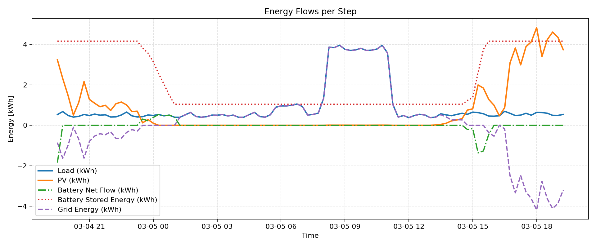
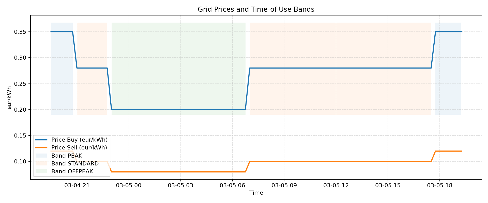
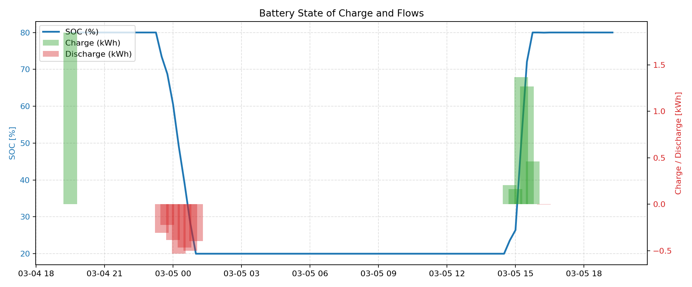
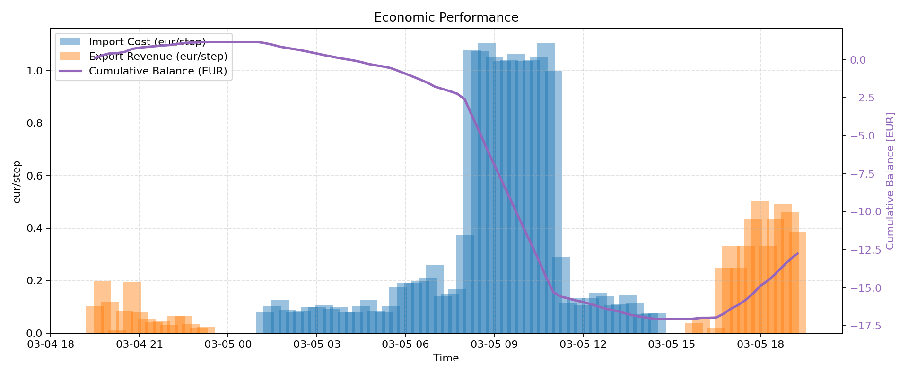

# End-to-End Simulation Guide (ODA → Generator → EMS)

This document walks through the complete workflow:

1. Start the **ODA** (Open Data Aggregator) platform.
2. Run the **Kafka generator**, which streams quarter-hour energy data (kWh).
3. Launch the **EMS** (`ems_realtime_kafka.py`), which consumes the stream, updates the microgrid and produces reports.

> ODA repository: [https://github.com/di-unipi-socc/ODA](https://github.com/di-unipi-socc/ODA)

---

## 0. Get the project

```bash
git clone https://github.com/di-unipi-socc/microgrid-simulator.git
cd microgrid-simulator
```

All commands assume you run them from inside the cloned `microgrid-simulator/` folder.

---

## 1. Prerequisites

- Git.
- Docker + Docker Compose.
- Python 3.10+ and `pip`.
- A CSV dataset with columns `datetime`, `solar`, `load` (average power per interval, in kW; the script automatically converts the samples to kWh).
- Free ports: `50005` (API Gateway), `9094`/`9095` (Kafka), `8086` (InfluxDB).

Repository layout after cloning:

```
microgrid-simulator/
├─ generator_and_consumer/   # generator + Kafka consumer utilities
│  ├─ data/
│  ├─ generatore_realtime_kafka.py
│  ├─ consumer_class.py
│  └─ ...
├─ docs/
├─ src/                      # customized PyMGrid fork
├─ ems_realtime_kafka.py
├─ ems_offline.py
├─ params.yml
└─ ...
```

Key scripts introduced with the latest refactor:

- `ems_realtime_kafka.py` remains the online EMS entry-point.
- `ems_offline.py` replays CSV traces without Kafka/ODA (ideal for quick tests).
- `tools.py` now hosts the shared helpers (config loading, price handling, plotting, live battery widget).
- `EMS.py` exposes the `Rule_Based_EMS` controller so both runners share the same logic.

---

## 2. Start ODA

```bash
git clone https://github.com/di-unipi-socc/ODA.git
cd ODA
```

1. Edit `.env` and make sure these keys are set:
   ```env
   kafka_address=127.0.0.1
   kafka_port=9094
   kafka_address_static=127.0.0.1
   kafka_port_static=9095
   ```
   Without them Kafka and the API Gateway will not start correctly.
2. Launch the stack:
   ```bash
   ./start.sh
   ```
3. Check the API Gateway:
   ```bash
   curl http://localhost:50005/register/dc
   ```
   The response must include `KAFKA_ENDPOINT`.
4. Stop ODA when finished:
   ```bash
   ./stop.sh
   ```

---

## 3. Kafka generator (`generator_and_consumer/`)

```bash
cd generator_and_consumer
python -m venv venv_generator      # or any name you prefer
venv_generator\Scripts\activate    # Windows
# source venv_generator/bin/activate  # Linux/macOS
pip install -r requirements.txt
```

- The generator expects CSV files under `generator_and_consumer/data/`. The default dataset is `data/processed_data_661_formatted.csv` (average power in kW); the script converts each sample to energy (kWh) by multiplying it by the step duration (`SAMPLE_TIME_HOURS`, 0.25 h).

Key settings in `generatore_realtime_kafka.py`:

```python
API_GATEWAY_URL = "http://localhost:50005"
TOPIC = "test_topic_661"
GENERATOR_ID = "casa_661"
DATA_FILE = Path(__file__).resolve().parent / "data" / "processed_data_661_formatted.csv"
DELTA_T_SEC = 0.1
```

Run the generator:

```bash
python generatore_realtime_kafka.py
```

The script registers the generator (`POST /register/dg`), reads the CSV, converts the kW values to kWh and sends JSON messages to Kafka, printing timestamp and values on screen. Keep it running while the EMS operates.

---

## 4. EMS (`ems_realtime_kafka.py`)

```bash
cd microgrid-simulator
python -m venv mio_env_ems
mio_env_ems\Scripts\activate    # Windows
# source mio_env_ems/bin/activate
pip install -r requirements.txt
```

### Configuration (`params.yml`)

```yaml
ems:
  kafka_topic: test_topic_661
  buffer_size: 96
  timezone: Europe/Rome
  steps: 96
  allow_night_grid_charge: false
  price_bands:
    peak:
      buy: 0.35
      sell: 0.12
      ranges:
        - [18, 20]
    standard:
      buy: 0.28
      sell: 0.10
      ranges:
        - [7, 17]
        - [21, 22]
    offpeak:
      buy: 0.20
      sell: 0.08
      ranges: []
```

Adjust the `battery` and `grid` sections to match your time-step length (default: 0.25 h for 15-minute data). `steps` controls the simulation length (96 = 24 hours, 672 = one week). Make sure the producer/consumer use the same `sample_time_hours` when you convert kW into kWh.

`allow_night_grid_charge` (default `false`) enables charging the battery from the grid during the `OFFPEAK` band with the greedy controller. If you want that behavior only offline you can keep it `false` in the YAML file and enable the CLI option instead (see the next section).

`ems_realtime_kafka.py` automatically adds `generator_and_consumer/` to `sys.path`, so the consumer class is available without further configuration.

The helper functions that used to live inside `ems_realtime_kafka.py` now reside in two reusable modules:

- `tools.py` handles configuration loading, dynamic price computation, reporting and plotting.
- `EMS.py` exposes the `Rule_Based_EMS` controller shared by both the online and offline runners.

### Run the EMS

```bash
python ems_realtime_kafka.py
```

What it does:

1. Loads configuration from `params.yml`.
2. Starts `KafkaConsumer` and waits for the first message.
3. Builds the PyMGrid microgrid in online mode.
4. For each step it reads the latest measurement, applies `rule_based_control`, calls `microgrid.step`, prints a report and stores the results.
5. At the end it:
   - Saves `outputs/ems_results_<timestamp>.csv`.
   - Generates plots (energy flows, grid exchange, prices, battery SOC, economics) in `outputs/`.
   - Prints a summary and tries to open the plots automatically.

> The `outputs/` folder is created automatically. Keep it in the repo (with a `.gitkeep`) so results land in a predictable location.

### Offline mode (`ems_offline.py`)

Use this runner when you want to test the EMS quickly without starting ODA/Kafka. It replays a local time series but leverages the same shared modules (`tools.py`, `Rule_Based_EMS`).

1. Place the CSV dataset (columns `datetime`, `solar`, `load`) under `data/` or adjust the path at the top of the script.
2. `params.yml` is parsed exactly like the online mode: same time-of-use bands and battery parameters 
3. Run:
   ```bash
   python ems_offline.py
   ```
   The script builds the `MicrogridSimulator` with `online=False`, computes price vectors via `compute_offline_tariff_vectors`, applies the greedy controller and writes `microgrid_log.csv`. At the end it opens a `pandasgui` window (optional) to compare dataset and log.

This mode is ideal for validating EMS changes or preparing demos without the full Kafka pipeline.

---

## 5. Suggested sequence

1. `./start.sh` inside the ODA folder.
2. `python generator_and_consumer/generatore_realtime_kafka.py` and keep it running.
3. `python microgrid-simulator/ems_realtime_kafka.py`.
4. Monitor EMS logs; when it finishes you will find CSV and plots inside `microgrid-simulator/outputs/`.
5. Stop with `Ctrl+C` on both generator and EMS, then `./stop.sh` inside ODA.

For quick experiments without the full infrastructure, run `python ems_offline.py`: it uses the same parameters and produces `microgrid_log.csv` plus the datasets displayed via `pandasgui`.

---

## 6. Sample output (96 steps)

The following figures show a real run (copied under `docs/images/` for reference):

  
*Energy per step: load, PV, net battery flow and grid exchange.*

  
*Import/export per step (bars) and cumulative curves.*

  
*Buy/sell prices with the configured time-of-use bands.*

  
*Battery state-of-charge (%) and charge/discharge energy.*

  
*Step costs/revenues and cumulative economic balance.*

---

## 7. Troubleshooting

| Issue | Possible cause / fix |
| --- | --- |
| `requests.exceptions.ConnectionError` in the generator | ODA/API Gateway is not running (check `./start.sh` and port 50005). |
| `KeyError: 'KAFKA_ENDPOINT'` | Gateway response is empty or malformed; inspect the API Gateway logs. |
| EMS waiting forever | No data on the topic (wrong topic, empty CSV, `steps` too large). |
| Weird time axis in plots | Ensure timestamps in the CSV are correct and the `timezone` in `params.yml` matches. |
| Battery never charges | The default rule based control charges only with PV surplus. Update `rule_based_control` if the grid should charge the battery. |

---

## 8. Useful resources

- `generator_and_consumer/consumatore_realtime_kafka.py`: lightweight consumer for debugging (kWh).
- `generator_and_consumer/consumer_class.py`: reusable Kafka consumer with rolling buffer.
- `docs/ems_realtime_kafka_guide.txt`: in-depth walkthrough of the EMS script.
- `docs/generatore_realtime_kafka_guide.txt`: quick reference for the generator script and timestamp handling.
- ODA documentation: [https://github.com/di-unipi-socc/ODA](https://github.com/di-unipi-socc/ODA)

> Simulation results (CSV + plots) are stored under `microgrid-simulator/outputs/`.
